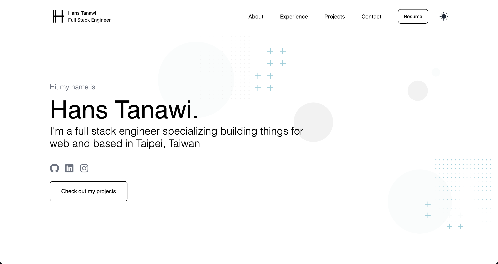

<div align="center">
  
</div>
<h1 align="center">
  hanstanawi.com
</h1>
<p align="center">
  The first iteration of <a href="https://www.hanstanawi.com" target="_blank">hanstanawi.com</a> built with <a href="https://www.nextjs.org/" target="_blank">Next.js</a>,  <a href="https://www.nextjs.org/" target="_blank">TypeScript</a>, <a href="" target="_blank">Tailwind CSS</a> and hosted on <a href="https://www.vercel.com" target="_blank">Vercel</a>
</p>
<br>


## 🛠 Installation and Set Up
Make sure <a href="https://www.nodejs.org" target="_blank">Node.js</a> is installed.

1. Install dependencies
   ```sh
   yarn
   ```
2. Start the development server
   ```sh
   yarn dev
   ```

## 🚀 Building and Running for Production
1. Generate a full static production build

   ```sh
   yarn build
   ```

2. Preview the site

   ```sh
   yarn start
   ```